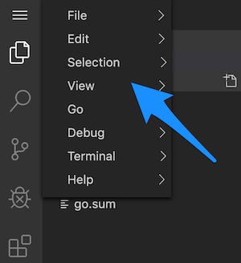

# Debugging microservices in Kubernetes

In the previous tutorials, we leveraged the service mesh from a developers' perspective to build resilience and observability into our service calls. This helps us both mitigate issues on the network between services as well as surface the appropriate signals to identify where and when there are issues. Ultimately, the service mesh can help save us from a cascading failure by improving resilience, but we need to couple this with debugging and fixing the issues altogether. 

In this part of the tutorial, we'll explore some mesh-complementary tools to debug a remote running microservice within your IDE and identify problems. We'll also explore how to do this in a more "production" like environment where you may not (most likely!) be able to connect up directly to the service running in production. We'll use a tool called `loop` that will allow us to record and reply requests from an environment. Let's get started.

### Note: building your code

When you build your code, you need to leave debug symbols in for the debugger to attach.
Our code actually does this with the following command.

```
	CGO_ENABLED=0 GOOS=linux go build -gcflags "-N -l" -o ./bin/service ./main.go ./tracing.go ./handler.go
```

## Debugging your services with Squash debugger

[Squash debugger](https://squash.solo.io) is a multi-language, distributed debugger that allows you to use your own IDE and other familiar tooling to debug microservices running in Kubernetes. Squash takes care of the plumbing to expose the debugging ports and remote debugger which should allow you to focus on "squashing" bugs instead of fumbling around with Kubernetes and `inode`s and so forth.


Squash is available as both a `squashctl` CLI tool as well as a plugin for VSCode. A plugin for IntelliJ/IDEA is also available, though a bit outdated. If there is interest in using this for IDEA, please let us know. For this tutorial, we'll use Squash through the VSCode extensions.

### Preparing

If you're running on your local machine, sometimes it takes a while to download some of the debugger images from the docker registry. Let's pre-pull the docker image needed to do the debugging for this exercise:

```shell
docker pull quay.io/solo-io/plank-dlv:0.5.18
```

<p>
  <Terminal target="vscode.container.shipyard" shell="/bin/bash" workdir="/work" user="root"/>
</p>

Now push the image to the internal Kubernetes repo:

```shell
shipyard push quay.io/solo-io/plank-dlv:0.5.18 k8s_cluster.k3s
```

<p>
  <Terminal target="vscode.container.shipyard" shell="/bin/bash" workdir="/work" user="root"/>
</p>


### Pick a pod to debug

From within the VSCode web-based IDE, hit "CTRL+Shift+P" to bring up the plugin dialog and start typing "Squash". If the keyboard shortcut doesn't work you can navigate to the upper left corner "View" sub menu and get the Command Pallet menu:




You should see the squash plugin pop up. Hit Enter on it:


Under the covers, the VSCode plugin leverages the `squashctl` cli tool, so you can use that alternatively if you wish. Squash will query the current Kubernetes context and navigate you through picking which service/pod you want to debug. Start by selecting the namespace to debug, in our case `default`:


Next, select a pod to debug. In this case we are going to debug the payment service, so start typing "pay..." into the search box to filter down the pods.


Next we need to pick which container to debug. Since we are deployed in a service mesh, we will need to decide between debugging the service-mesh sidecar or the application itself. In our case, we'll select the `payment` container.


Lastly, since Squash is a multi-language debugger, we need to decide which debugger to use. The source code for this service is written in Go, so we'll pick the `dlv` debugger. In future versions of squash, we're hoping to be able to auto-detect the language and default to a debugger. 


If this is your first time running Squash, give it a few moments to download the appropriate debugger image and get it started. For example, if you wish to see how it's doing, you can go to the terminal and check the `squash-debugger` namespace:

```shell
kubectl get po -n squash-debugger

```

<p>
  <Terminal target="vscode.container.shipyard" shell="/bin/bash" workdir="/work" user="root"/>
</p>

You should see something like this:

```
NAME         READY   STATUS              RESTARTS   AGE
plankt48h2   0/1     ContainerCreating   0          2m33s
```

If all goes well, you should be taken to the debug perspective:


### Setting break points

From here you can set a break point on the `payment-service` source code. The code that gets executed on a request is in the `handler.go` source. Place a break point on a location in that code and try exercise the `web` service which ultimately calls into the payment service:


Now if you exercise your service, you should hit the break point:


From here, you're in the VSCode debugger -- there's nothing special about squash here. You can step-by-step debug, step-over, or continue into the rest of the source code with full access to the call stack and context variables. You can use this approach to continue debugging for where things might be incorrect in your service. 


## Finding issues

In  the Canary section we have introduced an issue with the `payment-green` service we deployed. If you don't have that service deployed yet let's build it and deploy it.

Run the following commands to quickly get the broken green service up and running. From the `payment-service` folder, run:


```shell
cp ../exercises/canary/handler.go .
```

<p>
  <Terminal target="vscode.container.shipyard" shell="/bin/bash" workdir="/work/payment-service" user="root" expanded/>
</p>


This `payment-green` service introduces a bug. It uses a different HTTP client adorably named "sleep client". Specifically, we add this line:

```go
	c := &sleepy.HTTP{}
	resp, err := c.Do(req)
```

Now let's build and push the new code:

```shell
docker build -t nicholasjackson/broken-service:v6.0.0 .
shipyard push nicholasjackson/broken-service:v6.0.0 k8s_cluster.k3s
```

<p>
  <Terminal target="vscode.container.shipyard" shell="/bin/bash" workdir="/work/payment-service" user="root" expanded/>
</p>

Lastly, deploy the new service

```shell
kubectl apply -f exercises/canary/payments_green.yml
```

<p>
  <Terminal target="vscode.container.shipyard" shell="/bin/bash" workdir="/work" user="root" expanded/>
</p>


When we deploy this problematic service, we see 50% of the time we hit timeouts.  Let's debug that.

Now try calling our service:

```shell
curl web.ingress.shipyard:9090
```

<p>
  <Terminal target="vscode.container.shipyard" shell="/bin/bash" workdir="/work" user="root" expanded/>
</p>

### Debugging our sleepy client

In the previous section, we introduced a new HTTP client that seems to be causing some issues. Following the debugging steps from above, set some break points and step through to find out exactly where the code is slowing down. 


Once you've debugged into the code, you should be able to tell that the sleepy client implementation seems to be inefficient and slow. 

### Cleaning up

Once you're debugging session is done, whether you used the CLI or the IDE tools to bootstrap your debugger, it's always a good idea to clean up and lingering debugging sessions by deleting the `plank` pods in the `squash-debugger` namespace:

```shell
squashctl utils delete-planks
```

<p>
  <Terminal target="vscode.container.shipyard" shell="/bin/bash" workdir="/work" user="root" />
</p>
