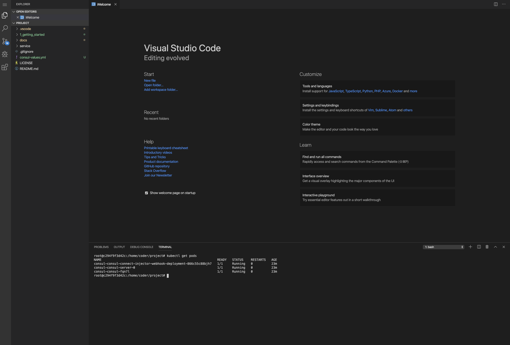
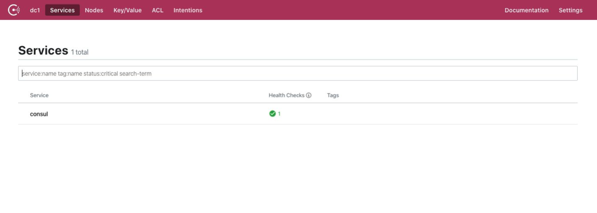

# Getting Started

Welcome to the Debugging Microservices Workshop. You have two options for accessing the workshop. The primary (and recommended) way when doing the workshop in person is to use the Instruqt environment. 

* [Launch Instruqt Environment](https://play.instruqt.com/hashicorp/tracks/debugging-microservices)

## Running locally 

Alternatively, you can download the Docker-based workshop source code. For that, you'll need Docker and Shipyard:

* Docker - [https://docs.docker.com/install/](https://docs.docker.com/install/)
* Shipyard - [https://github.com/shipyard-run/shipyard](https://github.com/shipyard-run/shipyard)


The code repository has source files and examples which will be used by this workshop, before continuing clone this repo.

```shell
git clone https://github.com/hashicorp/qcon-debugging-microservices.git
cd qcon-debugging-microservices
shipyard run ./stack
```

This will bring up the environment locally. The Consul, Gateway, and Jaeger tabs will open automatically.

## Understanding the workshop tabs

There are a handful of tabs that are available that expose the various components of the workshop. 

### Service (Web) UI

This tab allows you to directly call the Web service  that  has been deployed. Web ends  up calling other services, and you can see the chain in the UI. 


### Vscode UI

This tab gives you a fully operational coding  environment and terminal. See the following section for more information.



### Consul UI

Consul UI is available which gives you a UI into Consul Service Mesh.



### Jeager UI

We use Jaeger for distributed tracing in this lab.


### Docs

You would see these docs in the Docs tab.


## Development Environment

This workshop comes bundled with a built-in development environment. You can of course use your own IDE and terminal if you have the tools installed but for the purposes of this workshop we are going to be using the built in tools like Go, KubeCtl, Consul, etc.


### The demo application

Now that Kubernetes and Consul are running, you can install the example application.

Open a new terminal in the IDE ``Ctrl-Shift-` ``

The settings for `kubectl` and `consul` are already configured for you, give this a quick test.

### Getting all running pods `kubectl get pods`

```shell
kubectl get pods
NAME                                                              READY   STATUS    RESTARTS   AGE
consul-consul-connect-injector-webhook-deployment-866c55c88bjh7   1/1     Running   0          45m
consul-consul-server-0                                            1/1     Running   0          45m
consul-consul-fqn7l                                               1/1     Running   0          45m
```

### Display Consul members `consul members`
```shell
consul members
Node                    Address         Status  Type    Build  Protocol  DC   Segment
consul-consul-server-0  10.42.0.9:8301  alive   server  1.6.1  2         dc1  <all>
k3d-shipyard-server     10.42.0.6:8301  alive   client  1.6.1  2         dc1  <default>
```

When you now view the web service in your browser at [http://localhost:9090/ui](http://localhost:9090/ui), you will see the UI for `Fake Service`. Fake Service simulates complex service topologies. In this example, you have two tier system, `Web` calls an upstream service `API`. All of this traffic is flowing over the service mesh.


Fake Service is not that fake though, it also emits metrics and tracing data which is capture by `Jaeger`. We will learn more about how tracing works inside your application and in the service mesh in the next section. For now you can look at the dashboard by pointing your browser at [http://localhost:16686/search](http://localhost:16686/search)


## Summary

In this section you have learned how to set up a simple application in a development environment. In the next section we will start to investigate how Envoy and Service Mesh technology can be used to troubleshoot and debug cloud-native applications.